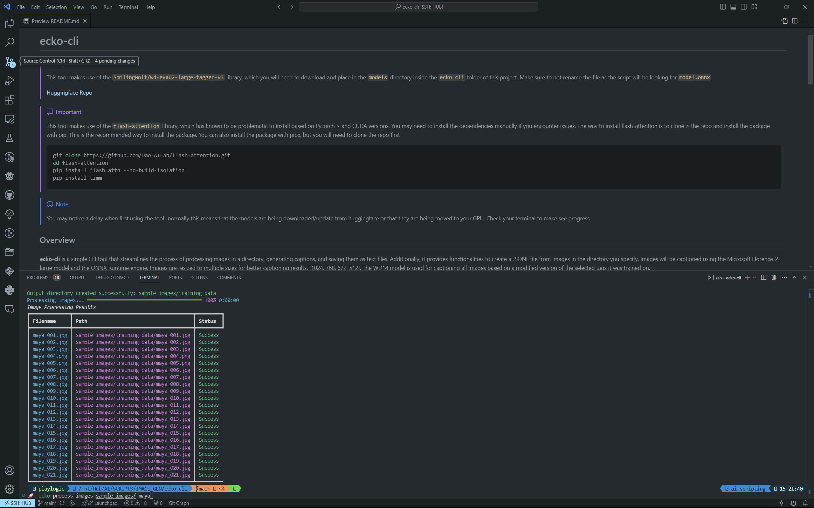

# ecko-cli


> [!IMPORTANT]
> This tool makes use of the `SmilingWolf/wd-eva02-large-tagger-v3` library, which you will need to download 
> and place in the `models` directory inside the `ecko_cli` folder of this project. Make sure to not rename
> the file as the script will be looking for `model.onnx`.
> 
> [Huggingface Repo](https://huggingface.co/SmilingWolf/wd-eva02-large-tagger-v3/tree/main)

> [!IMPORTANT]
> This tools has the option to now use the JoyCaption model for captioning images. You will need to have huggingface hub
> installed to download the model and the tokenizer. Also JoyCaption is a large model and will require a GPU with
> a healthy amount of memory.
> [Demo on Huggingface](https://huggingface.co/spaces/fancyfeast/joy-caption-alpha-two) //
> [Huggingface Repo](https://huggingface.co/fancyfeast/llama-joycaption-alpha-two-hf-llava)

> [!IMPORTANT]
> This tool makes use of the `flash-attention` library, which has known to be problematic to install based on PyTorch > and CUDA versions. You may
> need to install the dependencies manually if you encounter issues. The way to install flash-attention is to clone >  the repo and install the package with pip. This is the recommended way to install the package. You can also
> install the package with pip, but you will need to clone the repo first
>
>```bash
> git clone https://github.com/Dao-AILab/flash-attention.git
> cd flash-attention
> pip install flash_attn --no-build-isolation
> pip install timm
>```
> Install via pipx
> ```bash
> pipx inject ecko-cli flash_attn
> pipx inject ecko-cli timm
>```
> Install via the CLI
> ```bash
> ecko tools install-flash-attention
>```
>

> [!NOTE]
> You may notice a delay when first using the tool...normally this means that the models
> are being downloaded/update from huggingface or that they are being moved to your
> GPU. Check your terminal to make see progress

## Overview

**ecko-cli** is a simple CLI tool that streamlines the process of processingimages in a directory, generating captions, and saving them as text files.
Additionally, it provides functionalities to create a JSONL file from images in the directory you specify. Images will be captioned using the Microsoft Florence-2-large model and the ONNX Runtime engine. Images are resized to multiple sizes for better captioning results. [1024, 768, 672, 512]. The WD14 model is used for captioning all images based on a modified version of the selected tags it was trained on.




## Why

I wanted to create a tool that would allow me to process images in bulk quickly and efficiently for using in generative art projects. This tool
allows me to generate captions for images that I can use as training data captions for my training LORAs (Large OpenAI Research Agents) and other
generative models.


## Installation (Recommended)

You have a couple of options for installing/running the tool:

### Install [pipx](https://pipxproject.github.io/pipx/installation/), then run the tool with the following command

```bash
pipx install ecko-cli
```

### Alternatively, you can install using `pip`

```bash
pip install .
```

## Configuration

> [!IMPORTANT]
> Before using the tool, It's required to set up a `.env` file in the parent directory of the script or your home user dir [windows] or `$HOME/.config/ecko-cli-itsjustregi/.env`

The application intelligently locates your `.env` file, accommodating various platforms like Windows and Linux, or defaulting to the current directory.

## Usage // Available Commands

Once installed via pipx or pip:

```
ecko process-images /path/to/images watercolors --padding 4
```
```
ecko process-images --use_joy_cap /path/to/images watercolors --padding 4
```
```
ecko process-images /path/to/images doors --is_object True
```
```
ecko process-images /path/to/images doors --trigger WORD
```
```
ecko create-jsonl /path/to/images [dataset]
```
```
ecko ui /path/to/images
```


## Dependencies

This tool requires Python 3.11 or higher and has the following dependencies:

```bash
"typer",
"rich",
"shellingham",
"python-dotenv",
"onnxruntime-gpu",
"numpy",
"pandas",
"torch",
"pillow",
"einops"
"transformers"
"timm"
"torchvision"
"huggingface_hub[cli]"
```

### Contact

For any inquiries, feedback, or suggestions, please feel free to open an issue on this repository.

### License

This project is licensed under the [MIT License](LICENSE).

---
